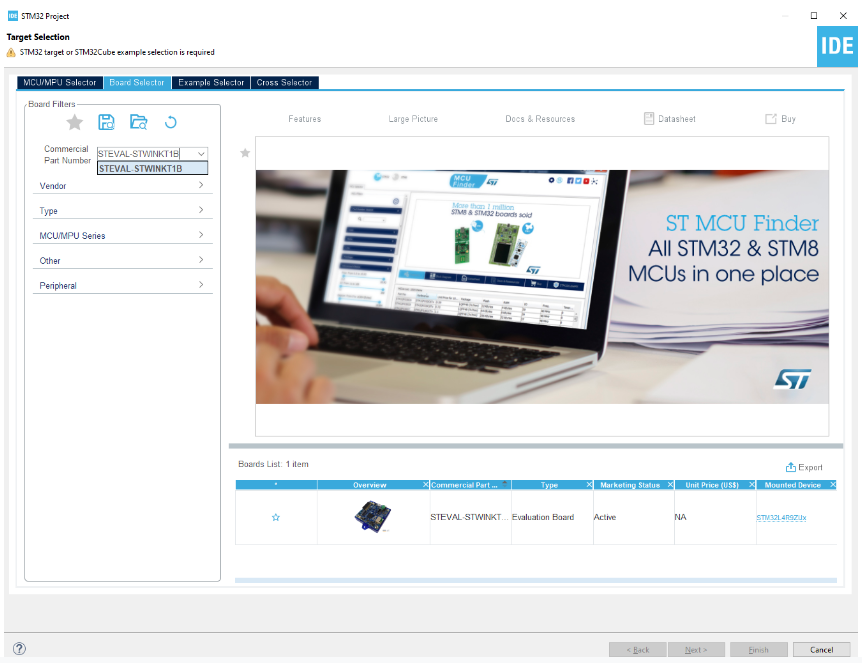
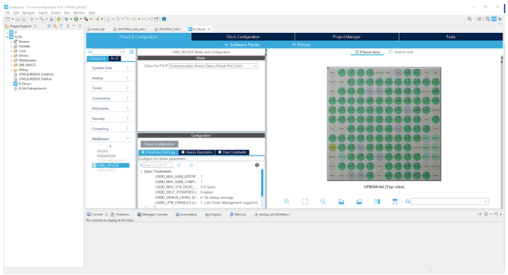
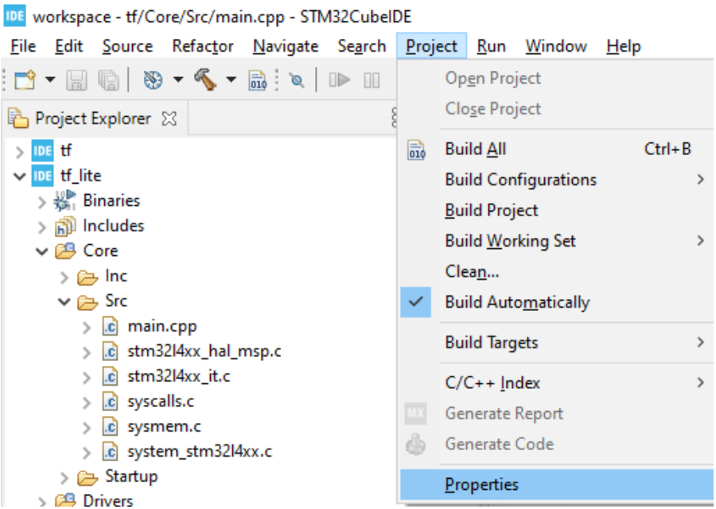
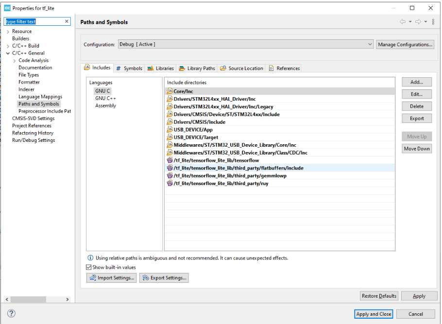
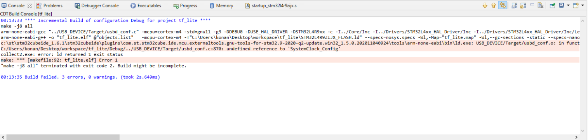
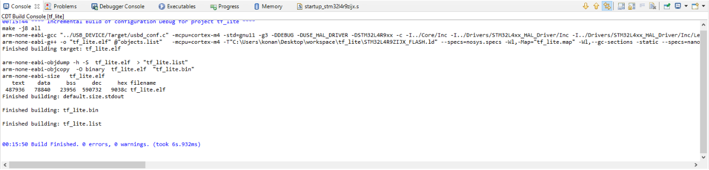

# Tensorflow Lite ile Modelin Boarda Yüklenmesi

Tensorflow lite  c++ kütüphanesini kurmak için öncelikle tensorflow reposunu lokal cihazımıza aşağıdaki kod ile indirilmeli:

    git clone https://github.com/tensorflow/tensorflow.git

Daha sonra reponun içerisine girdikten sonra aşağıdaki kod ile örnek projeleri oluşturacak make komutu çalıştırılmalı.

    ~cd tensorflow
    ~make -f tensorflow/lite/micro/tools/make/Makefile 

Daha sonra STM32CubeIDE programı ile ilgili board için proje oluşturulacak.



Daha sonra gerekli proje ayarları kuruluyor. Bu noktada “Target Language” kısmında c++ olarak seçilmeli. Diğer ayarla default olarak kalmalı. Açılan CubeMX ekranında USB_DEVICE içerisinde Class For FS IP “Communication Device Class(Virtual Port Com)” olarak ayarlanmalıdır. 



Daha sonra kullanacağımız tensorflow lite kütüphanesi c++ dili ile yazıldığından main.c dosyasının adı main.cpp olarak değiştirilmelidir. Oluşturulan modelin c dilindeki .h uzantılı hali  “./Core/Inc” dosyasının içine eklenmelidir. 

Tensorflow reposu içerisinde alınan “tensorflow” ve “third_party “dosyaları proje içerisinde oluşturulacak yeni bir klasörün içerisine eklenir. Bu projede bu klasöre “tensorflow_lite_lib” adı verilmiştir.

CubeIDE içerisinde build pathlerin ayarlanması gerekmektedir. Öncelikle properties ayarları açılmalı



Daha sonra Paths ve Symbols bölümünden Includes directories ayarlanmalı. Gerekli ayarlar aşağıdaki şekildedir.



Daha sonra “Source Location” listesine “tensorflow_lite_lib” klasörü eklenmelidir. Bu işlemler hem Debug hem de Release modunda yapılmalıdır.
Proje ayarları tamamlandıktan sonra, main.cpp örnek main.cpp’ye göre tekrardan düzenlenmelidir. Düzenlenme yapıldıktan sonra build işlemi yapıldığında aşağıdaki hata alınacaktır.



Bu hatayı çözmek için main.cppde bulunan void SystemClock_Config() methodu kopyalanarak usbd_conf.c dosyasına eklenmelidir. Tensorflow kütüphanesi içerisindeki DebugLog methodunun kullanılabilmesi için debug_log.cc dosyası içerisinde bulunan DebugLog methodu aşağıdaki ile değiştirilmelidir.

```
extern "C" void __attribute__((weak)) DebugLog(const char* s){}
```

Bu değişim ile main.cpp içerisinede oluşturalacak custom DebugLog methodunun override edilebilmesi sağlanacaktır. Bu işlem yapıldıktan main.cpp içerisine aşağıdaki methodu ekleyerek log mesajlarının uart aracılığı ile istenen porta aktarılması sağlanacaktır.

```
extern "C" void DebugLog(const char* s)
{
	HAL_UART_Transmit(&huart2, (uint8_t *)s, strlen(s), 100);
}
```

Yapılan bu değişiklikler örnek proje içerisinde bulunmaktadır. İhtiyaç duyulduğu takdirde örnek projeden faydalanılabilir. Bu işlem tamamlandıktan sonra build işlemi sorunsuz çalışacaktır.



STM32CubeIDE ile build işlemi sorunsuz tamamlandıktan sonra compiler tarafından oluşturulan makefile ile build işlemi için gerekli ayarlar yapılmalıdır.
Öncelikle Debug dosyasının içerisinde bulunan makefile içerisindeki absolute pathlerin her bir cihazda makefile’ın çalışabilmesi için aşağıdaki şekilde güncellenmesi gereklidir:

    “../path/in/Project”

Yine aynı dosya içerinde bulunan source.mk ve objects.mk içerisinde bulunan pathler güncellenmelidir. Debug file içerisinde bulunan bütün subdir.mk ve “.d” uzantılı dosyaların içerisindeki pathler belirtilen örnekteki şekilde düzenlenmelidir. Düzenlemeler yapıldıktan sonra aşağıdaki komut ile arm toolchain indirilmelidir.

    ~sudo apt install gcc-arm-none-eabi

Arm toolchain indirildikten sonra aşağıdaki komut Debug dosyası ile çalıştırıldığında proje build olacak ve “.bin”, “.elf“ ve “.hex” uzantılı dosyalar oluşturulacaktır. ”.bin” dosyası board USB ile bilgisayara bağlandığında oluşan harici disk içerisine atıldığında board programlanacaktır.

    ~make -j8 all
